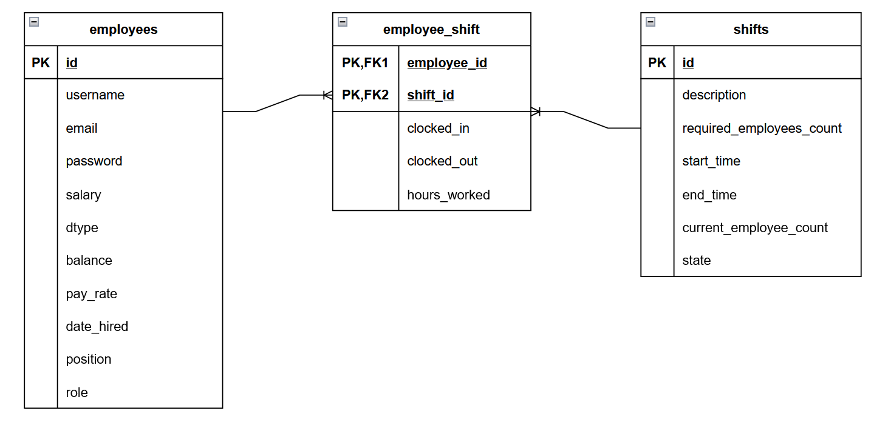

# Shift Scheduler API
RESTful API built with Spring Boot, Sping Data JPA, Spring Security and PostgreSQL.

## Technologies Used
- **Language:** Java 17
- **Database:** PostgreSQL 18+
- **Database Access:** Spring Data JPA
- **Security Scheme:** Bearer Tokens (JWT)

## Key Technical Insights
- Used the ```@EntityGraph``` annotation to populate the entities being fetched to avoid complex ```fetch``` queries
- Used the ```ApplicationReadyEvent``` event to initialize an employee with the ADMIN role
- Used the ```@Scheduled``` annotation to check for unclosed shifts in one minute intervals
- Used Spring Data JPA's ```@MapsId``` and ```@EmbeddedId``` to give many-to-many relationship instances attributes/properties
- Used ```@PreAuthorize``` to authorize who is using accessing the endpoint
- Used ```@AuthenticationPrincipal``` to access the current user's details

## Features
- The user is able to log in as admin with the credentials as configured by the environment variables.
- The admin can access all endpoints including ones special to the admin.
- The admin cannot clock in/out of shifts nor can they claim/drop shifts.
- There are two roles: WORKER and MANAGER.
- There are three shift states: UPCOMING, IN_PROGRESS and CLOSED.
- Only the MANAGER role can create, update and delete shifts.
- Both roles can clock in/out of the shift and read shift information.
- Both roles can claim/drop shifts.
- Both roles can update their own contact information.
- Only the admin can update the managers non-contact information.
- Both the admin and manager can update the workers non-contact information.
- Both roles can basic employee information (username, position, role, date hired, and pay-rate/salary).
- Both roles cannot interact with the shift once it has reached the CLOSED state.
- Shift state automatically updates to IN_PROGRESS if current time is within the shifts start and end times.

## Prerequisites
- **Java Development Kit (JDK 17+)**
- **PostgreSQL 18+** for the database
- **Maven as the build tool**
- **Postman** or **cURL** for API testing

## Installation Guide
1. Clone the GitHub repository and head inside the project folder through your terminal
```shell
git clone https://github.com/raafiAbdul/shift-scheduler-api.git
cd shift-scheduler-api
```
2. Configure your environment variables
```shell
DB_URL = jdbc:postgresql://localhost:5432/mydb
DB_USERNAME = your_username
DB_PASSWORD = your_password
ADMIN_USER = admin_username
ADMIN_PASS = admin_password
```
3. Run the application

**On Windows**
```shell
.\mvnw.cmd spring-boot:run
```

**On macOS/Linux**
```shell
./mvnw spring-boot:run
```

## API Endpoints and Sample Usage
You can check this link out for the [API Endpoints](https://shift-scheduler-api-production.up.railway.app/swagger-ui/index.html). This is the OpenAPI documentation for this API.
If it asks you to log in, use these credentials:

Username: admin\
Password: password

## Entity-Relationship Diagram



## Contributions
Contributions, feedback, and issue reports are very welcome! Feel free to open a Pull Request or issue if you have suggestions for code optimization or architectural improvements.